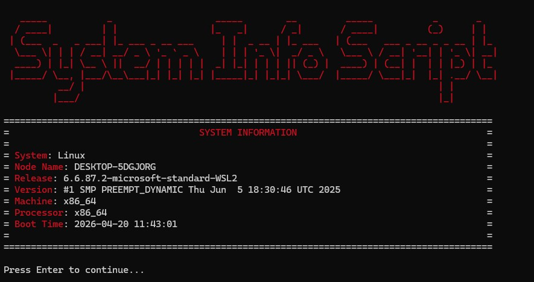

# 🖥️ System Info Script (python)

Simple Python CLI application for displaying system information such as CPU, memory, disk usage, and OS details.

This is my first completed project in my portfolio. Although it may seem simple, I chose this project as a starting point to demonstrate my learning process, problem-solving approach, and growing technical skills.

In this README, you will find the project goals, its purpose, how it works, the technologies used, challenges I encountered and how I solved them, as well as screenshots and ideas for future improvements.

---

## 🎯 Project Goal

The goal of this project was to:

* practice Python fundamentals
* work with system-level data
* build a simple interactive CLI application
* simulate a basic monitoring tool (DevOps-oriented)

---

## ⚙️ Features

* Display system information (OS, hostname, boot time)
* Show CPU usage and core count
* Monitor memory and swap usage
* Display disk usage and partitions
* Interactive menu for selecting specific data
* Clear screen between actions for better user experience

---

## 🛠️ Technologies Used

* Python
* `psutil` – system resource monitoring
* `platform` – OS information
* `colorama` – colored CLI output

-- 

## 👍 Pre-requisites

To run this script, make sure you have the following installed:

- Python 3.8 or higher  
- pip (Python package manager)

### 📦 Required Python libraries

Install dependencies using:

```bash
pip install psutil colorama
```

### 💻 Supported environments

- Linux / macOS / Windows  
- WSL (Windows Subsystem for Linux)

---

## 🚀 Installation

```bash
git clone https://github.com/MartinTomcikMT/system-info-script.git
cd system-info-script
pip install psutil colorama
```

---

## ▶️ How to Run

```bash
python sysinfosc.py
```

> ⚠️ Note: Some system information may vary depending on your operating system.

---

## 🚀 How It Works

1. User runs the script  
2. Interactive menu is displayed  
3. User selects what information to view:
   - system
   - CPU
   - memory
   - disk  
4. Selected data is displayed in the console  
5. Screen is cleared between actions for better readability  
6. Program runs continuously until user exits  

---

## 🧠 What I Learned

- Working with external Python libraries (`psutil`, `colorama`)
- Handling user input in CLI applications
- Structuring code using functions
- Creating interactive loops (`while True`)
- Improving user experience in terminal applications

---

## ⚠️ Challenges & Solutions

### Problem:
Issues with Python environment and library installation on Windows  

### Solution:
Used WSL (Linux environment) and proper package installation:

```bash
pip install psutil colorama
```

---

### Problem:
Accidentally committed `venv` directory to GitHub  

### Solution:

- Removed it using `git rm -r --cached venv`  
- Added `.gitignore` to prevent future issues  

---

## 📸 Screenshot

<p align="center">
  
</p>

---

## 📌 Future Improvements

- Add real-time monitoring (auto-refresh)
- Implement warning alerts (e.g. high CPU usage)
- Export logs to file
- Improve UI layout

---

## 👤 Author

Martin Tomcik  
Aspiring DevOps Engineer ☁️
